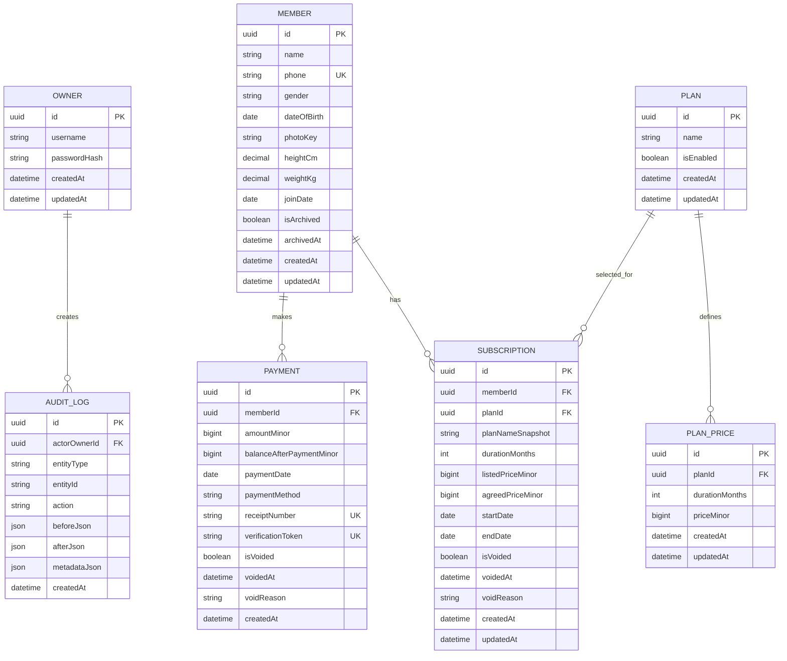

# ERD

The following is a proposed V1 logical ERD. Column details may change during technical design, but the business relationships should remain stable.

## Key Constraints

- `member.phone` unique.
- `plan_price(planId, durationMonths)` unique.
- `durationMonths` restricted to 1, 3, 6, 12.
- Monetary values are integer minor units (1 EGP = 100 minor units) and must be non-negative.
- Payment amount must be greater than zero.
- Receipt number unique.
- Verification token unique, randomly generated, and unpredictable.
- Overlapping non-voided subscriptions for the same member are prohibited by application/domain validation, with transactional protection against race conditions.

## Deliberately Not Modeled in V1

- Attendance.
- Trainers.
- Notifications.
- Subscription cancellation.
- Payment allocation.
- Credit balance.
- Gym settings/profile.
